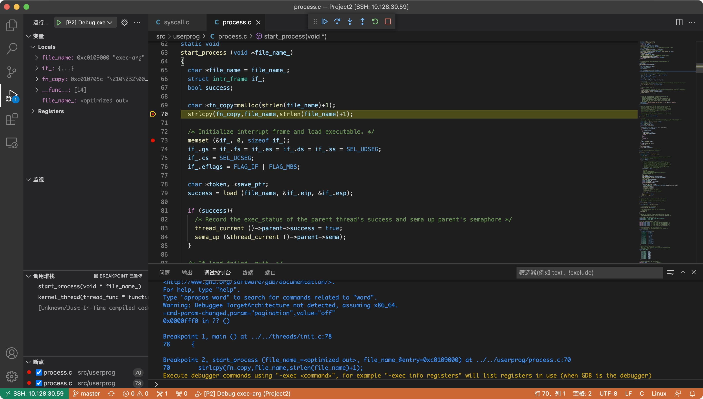
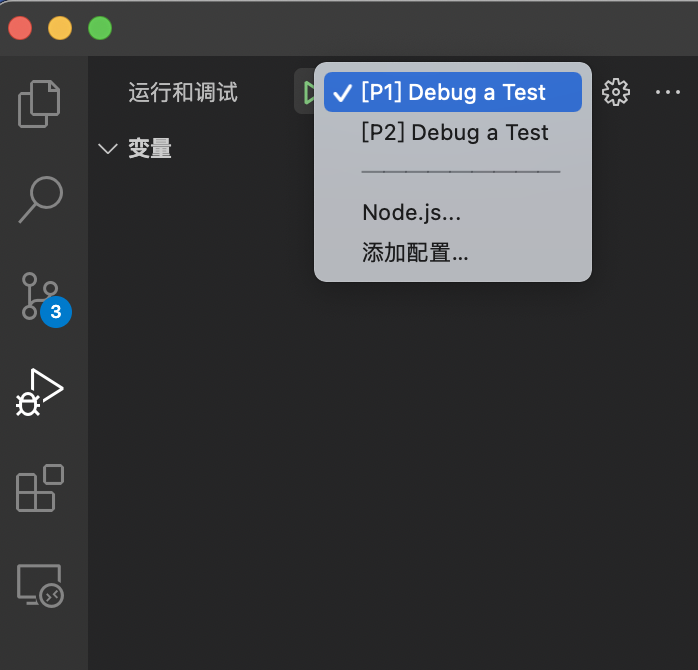

## 这是用来干什么的？

 ： 让你在vscode里调试你的pintos，就像调试一个hello world程序一样简单。

效果如图:

## 怎样使用？

 使用此仓库的前置条件：

- 首先你得有一个能运行pintos的环境(废话)
- 安装vscode，及C/C++扩展
- 你的bochs支持**nogui**，如果你的bochs不支持nogui，你可以重复教程中的编译安装bochs部分，在执行./configure的时候加上--with-nogui

**如果你的pintos运行在我的docker内，很遗憾本仓库暂时无法兼容docker内环境。**

首先，用vscode打开你的pintos项目，确保src目录在一级目录下。把**launch.json , settings.json , tasks.json**放进**.vscode**目录下。

这个时候点左侧的debug按钮，应该能看到两个选项，如图:



对于project1，你只需要运行[P1]Debug a Test，在弹出的输入框内输入你想要调试的测试点(如:alarm-priority)，在打好断点的情况下，你的vscode就会自动执行好pintos文档里提到的debug步骤，你就可以愉快地查看变量、步进等等了。

对于project2，步骤稍微复杂一些。

仓库里的debug.list文件是一个示范，每行包含了一条pintos在make check时执行的命令，例如：

```shell
pintos -v -k -T 60 --bochs  --filesys-size=2 -p tests/userprog/args-none -a args-none -- -q  -f run args-none < /dev/null 2> tests/userprog/args-none.errors > tests/userprog/args-none.output
```

你需要注意的是"-a","-p","run"之后跟随的内容(本例中是"args-none","args-none","args-none")，在弹出的输入框内依次输入这三个，其余操作同project1。
想要project3的内容请找我击剑或者自己照着前面的推理一下，懒得单独commit了。


## 推荐的使用方法

- 使用vscode的ssh功能连接本地运行的ubuntu虚拟机
- 使用vscode的ssh功能连接其他服务器
- 如果你的操作系统就是ubuntu的话，直接用就行
